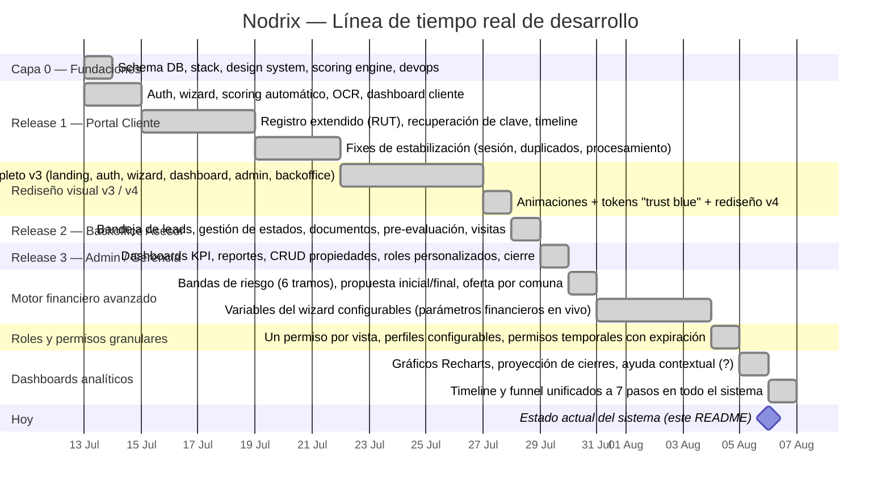

# Nodrix — Plataforma Inmobiliaria Inteligente

Plataforma para gestionar el ciclo completo de inversión/adquisición inmobiliaria con crédito
hipotecario: desde el lead inicial y el scoring crediticio, hasta la escrituración y cierre,
pasando por validación documental (OCR), evaluación de riesgo por bandas, propuestas del asesor,
un panel de administración con permisos granulares y KPIs en vivo, y seguimiento en tiempo real
para el cliente.

**Stack:** Next.js 16 (App Router) + React 19 + TypeScript + Tailwind CSS 4 · Supabase
(Postgres + Auth + Storage + Realtime) · Recharts (dashboards) · Vercel (hosting) · Diseño
dark-mode premium minimalista.

> ⚠️ Todo lo financiero/bancario en este MVP es **simulado (mock)** — no existe integración real
> con bancos todavía. Cualquier "% de aprobación" o "propuesta" mostrada al cliente está
> explícitamente etiquetada como simulación sujeta a confirmación real.

---

## Estado actual

El proyecto se construyó en 3 releases incrementales sobre una capa de fundaciones, y desde
entonces ha recibido dos rondas de rediseño visual completo y una capa nueva de administración
avanzada (permisos granulares + dashboards analíticos). **Está desplegado en Vercel** con
auto-deploy en cada push a `master` (Supabase como backend gestionado).

| Fase | Contenido | Estado |
|---|---|---|
| Capa 0 — Fundaciones | Schema multi-tenant ready, stack, design system, scoring engine, devops local | ✅ Completo |
| Release 1 — Portal Cliente | Registro, login, wizard, scoring automático, subida de documentos, dashboard cliente | ✅ Completo |
| Rediseño visual v3 / v4 | Landing, auth, wizard, dashboard, admin y backoffice con nuevo sistema de diseño | ✅ Completo |
| Release 2 — Backoffice Asesor | Bandeja de leads, gestión de estados, revisión de documentos, pre-evaluación, visitas | ✅ Completo |
| Release 3 — Admin/Gerencia | Dashboards, reportes, gestión de propiedades, escrituración/cierre | ✅ Completo |
| Motor financiero avanzado | Bandas de riesgo de 6 tramos, propuesta inicial/final, variables del wizard configurables | ✅ Completo |
| Roles y permisos granulares | Un permiso por vista, perfiles configurables, permisos temporales con expiración | ✅ Completo |
| Dashboards analíticos | Gráficos Recharts, proyección de cierres, ayuda contextual, funnel unificado de 7 pasos | ✅ Completo |
| Producción real | Integración bancaria real, dominio propio, RLS habilitado, monitoreo | ⬜ Pendiente (ver [Gaps](#qué-falta-para-salir-100-a-producción)) |

---

## Línea de tiempo del proyecto (Gantt)



> El Gantt refleja la agrupación real de ~161 commits entre el **13 de julio** y el **6 de agosto
> de 2026** (rango de fechas de `git log`), agrupados por hito funcional — no son fechas de
> planificación previa, son el registro real de cuándo se construyó cada pieza.

---

## Qué hace el sistema hoy

### 1. Captura y perfilamiento del cliente
- Landing con soft-login y wizard de perfilamiento dinámico en 3 pasos (situación laboral,
  antigüedad, tipo de contrato, renta, ahorro, tipo de inversión, destino del inmueble: vivir /
  Airbnb / arriendo / venta a corto plazo).
- Registro extendido: RUT (con validación de dígito verificador chileno módulo 11), apellidos,
  sexo, fecha de nacimiento, renta, tipo de inversión, estado del inmueble deseado.
- Recuperación de contraseña por email, indicador de fuerza de contraseña.

### 2. Scoring crediticio automático
- Motor determinístico (`lib/scoring.ts`) que pondera **renta (35%)**, **ahorro (25%)**,
  **estabilidad laboral (20%)** y **carga financiera/DTI (20%)** → score de 0 a 100.
- 5 categorías: **BRONCE (0-39) · PLATA (40-59) · ORO (60-74) · PLATINO (75-89) · BLACK (90-100)**.
- Reglas de scoring versionadas y **configurables desde el panel admin** (`scoring_rule_sets`),
  sin necesidad de re-desplegar código. Espejo en SQL (`database/functions/scoring_fn.sql`) para
  poder ejecutar el mismo cálculo directamente en Postgres.

### 3. Motor de pre-evaluación e ingresos mixtos
- **Ingresos por tipo** (`lib/income-types.ts`): sueldo fijo, boleta, pensión, alquiler o
  sociedad — cada uno con su propio "haircut" (descuento) que aplica la banca chilena real (ej.
  boleta variable se descuenta 40%, pensión según tramo etario, sociedad se excluye por completo
  si no acredita liquidez), y su propio checklist de documentos de respaldo. Un cliente puede
  declarar varias fuentes de ingreso a la vez (ingreso mixto).
- **Pre-evaluación en UF** (`lib/uf-preevaluation.ts`): fórmula estándar de anualidad hipotecaria
  chilena, evaluando 3 parámetros bancarios reales:
  1. **Relación Renta/Dividendo** — el dividendo nuevo no puede superar 1/3 del ingreso.
  2. **Carga Financiera** — tope que sube por tramo de renta (40% / 50% / 55%).
  3. **Leverage** — múltiplo máximo de deuda de corto plazo sobre ingreso, también por tramo.
- **Plazo del crédito** (`lib/loan-term.ts`) ajustado por edad y nivel profesional del titular.

### 4. Simulación de riesgo por bandas (antes de subir documentos)
- Tras el scoring, el cliente ve **6 tramos de departamentos** (1 · 1-2 · 2-3 · 3-4 · 4-5 · 5-6)
  cada uno con un **% estimado de probabilidad de aprobación bancaria**, calculado a partir de su
  score real y la dificultad relativa de cada tramo (`lib/proposal-risk.ts`).
- Siempre se muestran ambos enfoques (inversión / vivienda propia) aunque el cliente se haya
  registrado solo con uno.
- Paso **obligatorio** del wizard: el cliente debe elegir una banda para poder avanzar a la
  subida de documentos. Explícitamente marcado como simulación.

### 5. Documentación con OCR
- Subida de documentos (Supabase Storage) con validación automática por OCR (Tesseract.js): tipo
  de documento, titular y contenido.
- El checklist de documentos requeridos se arma dinámicamente según la(s) situación(es) laboral(es)
  declaradas (`lib/document-requirements.ts`) — misma fuente de verdad para el cliente (Bóveda
  documental) y para el asesor (checklist en `/backoffice/[id]`, cargado/no cargado).
- Documentos válidos se auto-aprueban y la solicitud avanza automáticamente a
  `DOCUMENTOS_APROBADOS`.

### 6. Máquina de estados de la solicitud
- **9 etapas reales** en el backend (gating de negocio, transiciones, historial de auditoría):
  ```
  RECEPCIONADA → SCORING_COMPLETADO → DOCUMENTOS_PENDIENTES → DOCUMENTOS_APROBADOS
    → PRE_EVALUACION_COMPLETADA → VISITA_COMPLETADA → ENVIADO_A_BANCO
    → ESCRITURACION_AGENDADA → CIERRE
  ```
- **7 pasos visuales** en toda la interfaz (cliente, asesor y admin): `VISITA_COMPLETADA` se
  fusiona visualmente con `DOCUMENTOS_PENDIENTES` (ocurren en paralelo en la práctica) y
  `PRE_EVALUACION_COMPLETADA` queda oculta (paso "Aprobado previo", sigue existiendo como stage
  real). Este mapeo vive en un único lugar (`BACKEND_STAGE_TO_CLIENT_BUCKET`,
  `components/dashboard/types.ts`) y gobierna la timeline del cliente, la timeline del asesor, el
  Funnel de Estados y "Solicitudes en curso por estado" del admin — los 4 lugares muestran
  siempre el mismo agrupamiento.
- Transiciones automáticas donde no requieren intervención humana, y transiciones manuales con
  gates de negocio explícitos (ej. no se puede avanzar a `ESCRITURACION_AGENDADA` sin que el
  cliente haya aceptado una opción de la propuesta final del asesor).
- Historial completo de transiciones (`application_stage_history`) con notificaciones por email
  en cada cambio de estado.

### 7. Backoffice del asesor
- Bandeja de leads con filtros y vista tipo tabla/Excel por estado y categoría de scoring.
- Detalle de solicitud (`/backoffice/[id]`): timeline horizontal de 7 pasos con fechas reales de
  llegada a cada uno, checklist de documentos (cargado/no cargado según situación laboral),
  pre-evaluación real, notas, cambio de estado, asignación/reasignación de asesor.
- Gestión de visitas programadas (crear, listar, marcar realizadas).
- Oferta por comuna: el cliente ve propiedades disponibles según su comuna preferida y puede
  agendar visita directamente desde su panel una vez en `PRE_EVALUACION_COMPLETADA`.
- **Propuesta final:** después de la visita y el envío al banco, el asesor carga hasta 6 opciones
  concretas (departamento, comuna, precio en UF, notas) que el cliente debe revisar y aceptar
  antes de avanzar a escrituración.

### 8. Panel admin / gerencia
- **Dashboard ejecutivo** con gráficos Recharts: Funnel de Estados (7 pasos), distribución de
  scoring (donut), timeline de cierres, **proyección de cierres** (próximos 30/60/90+ días,
  calculada sumando la duración promedio histórica real de cada etapa restante por solicitud
  activa — no un promedio global), desviaciones de proceso, desempeño por asesor, inventario de
  propiedades.
- Cada analítica trae un botón **"?"** con "qué mide" y "cómo se calcula", para dar contexto
  operativo sin depender de este README.
- **Reportes** exportables con los mismos gráficos, filtrables por fecha/asesor/etapa/categoría.
- CRUD de propiedades (comuna, propósito, plano, precio UF) y de regiones habilitadas.
- Configuración en vivo de los pesos y umbrales del motor de scoring, y de las **variables del
  wizard** (parámetros financieros: tramos de carga financiera, leverage, plazo de crédito) con
  publicación versionada — una solicitud ya calculada nunca cambia sus parámetros aunque se
  publique una versión nueva.
- Gestión de escrituración y cierre.

### 9. Roles y permisos granulares
- **Una vista de menú = un permiso independiente** (9 permisos: KPIs, Reportes, Backoffice,
  Asignar asesor, Visitas, Crear propiedad, Regiones, Mantenedor de usuarios, Variables del
  wizard), derivados automáticamente de un único registro de navegación
  (`lib/nav-registry.ts`) — agregar una vista nueva al menú la agrega también a la matriz de
  permisos sin tocar código adicional.
- **Perfiles configurables:** admin puede editar los permisos por defecto de los roles `asesor` y
  `gerencia` (el rol `admin` nunca es restringible — 4 capas independientes de protección
  anti-lockout). Roles personalizados con permisos por módulo.
- **Permisos temporales por usuario:** un permiso se puede habilitar a un usuario específico por
  un período de tiempo; solo puede **elevar** el acceso por encima de su perfil, nunca
  restringirlo, y expira automáticamente evaluando la fecha en cada consulta (sin depender de un
  cron job que podría no correr).
- Todas las páginas de `/admin/*` tienen su propio guard de permiso (no solo el menú, que era
  cosméticamente filtrable pero no bloqueaba acceso directo por URL).

### 10. Experiencia de cliente
- Dashboard con timeline horizontal de 7 pasos, barra de progreso global, estimador de tiempo por
  etapa, alertas contextuales y videos explicativos embebidos por etapa.
- Bóveda documental con checklist visual por situación laboral declarada.
- Menú de cuenta (editar datos, cambiar contraseña, cerrar sesión).
- Guardas de sesión y de rol en todas las rutas protegidas (`/dashboard`, `/backoffice`, `/admin`).

---

## Arquitectura general

```
app/                       # Next.js App Router
  auth/                    # register, login, forgot/reset-password
  onboarding/              # welcome, wizard, processing, proposal, simulating
  dashboard/               # Portal cliente + Bóveda documental
  backoffice/              # Bandeja del asesor + detalle + propiedades + visitas
  admin/                   # Dashboard, reportes, usuarios, roles, propiedades, regiones, variables
  api/                     # ~17 grupos de route handlers (auth, leads, applications, admin, ...)
components/
  ui/                      # Design system base (shadcn/ui, dark-themed)
  admin/, backoffice/, dashboard/, wizard/, onboarding/, vault/, landing/
  Timeline.tsx             # Componente único de timeline (horizontal/vertical), usado por TODOS los roles
lib/                       # Motores de negocio (scoring, riesgo, permisos, etc. — ver abajo)
database/
  schema.sql               # Schema completo multi-tenant ready
  migrations/               # 37 migraciones incrementales aplicadas
  functions/                # scoring_fn.sql (espejo SQL del motor de scoring)
tests/
  unit/                    # 13 archivos, 123 tests (motores de scoring, riesgo, permisos, etc.)
  e2e/                     # Playwright: flujo completo lead → cierre
```

### Stack

| Capa | Tecnología |
|---|---|
| Frontend | Next.js 16 (App Router) + React 19 + TypeScript |
| Estilos | Tailwind CSS 4, design tokens dark-mode premium |
| Gráficos | Recharts (dashboards admin/reportes) |
| Backend | Supabase (Postgres + Auth + Storage + Realtime), vía Route Handlers de Next.js |
| OCR | Tesseract.js (validación de documentos en cliente) |
| Email | Nodemailer |
| Testing | Vitest (unit), Playwright (E2E) |
| Hosting | Vercel (auto-deploy en push a `master`) + Supabase |

---

## Estructura de datos

- **Multi-tenant ready desde el día 1:** toda tabla de negocio lleva `org_id UUID`, aunque en el
  MVP se opera con un solo tenant fijo (RLS preparado, deshabilitado operativamente).
- Todas las cantidades de propiedad usan **UF (Unidad de Fomento)**, la unidad de referencia
  chilena para precios inmobiliarios e hipotecarios.
- **37 migraciones aplicadas** (`database/migrations/002` a `037`), agrupables en:
  - **Dominio core:** `applications`, `customers`, `documents`, `properties`, `visits`,
    `application_stage_history`, `audit_events`.
  - **Scoring y riesgo:** `scoring_rule_sets` (versionado), tramos de carga financiera/leverage
    por renta, bandas de riesgo de 6 tramos, plazos de crédito por edad/nivel profesional.
  - **Perfil financiero del cliente:** `income_sources` (ingresos mixtos), deuda total, nivel
    profesional, comuna/propósito/destino de propiedades.
  - **Propuestas:** propuesta inicial seleccionada por el cliente, opciones de propuesta final
    cargadas por el asesor y su aceptación.
  - **Variables del wizard:** `wizard_variable_sets` (parámetros financieros versionados y
    publicables) + anclaje por solicitud (`wizard_variable_set_id`) para que una solicitud ya
    calculada no cambie de parámetros retroactivamente.
  - **Permisos:** `role_permissions` (overrides por perfil configurable), `custom_roles`,
    `user_permission_grants` (permisos temporales con expiración evaluada en query-time).

---

## Cálculos y motores (100% determinísticos, sin IA generativa)

Todo el motor financiero es reglas de negocio explícitas — mismo input, mismo output siempre,
auditable y versionado. Los cuatro motores principales:

1. **Scoring** (`lib/scoring.ts`) — pondera 4 factores (suman exactamente 100 puntos) →
   categoría BRONCE a BLACK. Configurable desde admin sin re-deploy.
2. **Ingresos mixtos** (`lib/income-types.ts`) — consolida varias fuentes de ingreso en un
   ingreso efectivo único, aplicando el "haircut" y el tope de leverage específico de cada tipo,
   excluyendo fuentes que no califican (ej. arriendo bajo 6 meses de contrato).
3. **Pre-evaluación UF** (`lib/uf-preevaluation.ts`) — fórmula de anualidad hipotecaria + 3
   parámetros bancarios reales (Renta/Dividendo, Carga Financiera, Leverage) para estimar el
   rango de UF que el cliente podría calificar.
4. **Riesgo por bandas** (`lib/proposal-risk.ts`) — % de aprobación estimado por tramo de
   departamentos, en función del score y la dificultad relativa de cada tramo.

Y dos motores de agregación en el panel admin (`app/api/admin/kpis/route.ts`):

5. **Desviaciones de proceso** — compara cuánto lleva una solicitud activa en su etapa actual
   contra el promedio HISTÓRICO real de esa etapa (calculado del propio historial de
   transiciones, no un umbral inventado); marca las que superan 1.5x.
6. **Proyección de cierres** — para cada solicitud activa, suma la duración promedio histórica de
   cada etapa que le falta hasta Cierre y la agrupa en horizontes de 0-30/31-60/61-90/90+ días.

---

## Pruebas

- **Unit tests:** 13 archivos / 123 tests — motores de scoring, riesgo de propuestas,
  pre-evaluación, ingresos mixtos, permisos (incluyendo el candado anti-lockout de admin), y
  registro de navegación/permisos.
- **E2E (Playwright):** flujo completo lead → scoring → propuesta inicial → documentos →
  pre-evaluación → visita → banco → propuesta final → escrituración → cierre
  (`tests/e2e/full-flow.spec.ts`), 14 escenarios, 100% verde.

---

## Qué falta para salir 100% a producción

```
┌──────────────────────────────────────────────────────────────────────┐
│  GAP 1 — Infraestructura de producción real                          │
├──────────────────────────────────────────────────────────────────────┤
│  ⬜ Confirmar Supabase Cloud (no local) con todas las 37 migraciones   │
│  ⬜ Habilitar RLS real por organización (hoy está deshabilitado)       │
│  ⬜ CI/CD: pipeline que corra unit + E2E antes de cada deploy          │
│  ⬜ Dominio propio (hoy: subdominio de Vercel)                         │
└──────────────────────────────────────────────────────────────────────┘

┌──────────────────────────────────────────────────────────────────────┐
│  GAP 2 — Integraciones externas reales                                │
├──────────────────────────────────────────────────────────────────────┤
│  ⬜ Integración bancaria real (hoy: 100% mock/simulado)                │
│  ⬜ Envío de emails transaccional en producción (proveedor real)       │
│  ⬜ Valor UF real vía API (mindicador.cl), hoy es una constante fija   │
│  ⬜ Notarías / escrituración: hoy es workflow manual                   │
└──────────────────────────────────────────────────────────────────────┘

┌──────────────────────────────────────────────────────────────────────┐
│  GAP 3 — Seguridad y cumplimiento                                     │
├──────────────────────────────────────────────────────────────────────┤
│  ⬜ Auditoría de seguridad (manejo de RUT, datos financieros, PII)     │
│  ⬜ Políticas de retención y borrado de datos personales               │
│  ⬜ Rate limiting / protección anti-abuso en endpoints públicos        │
│  ⬜ Revisión de permisos y RLS antes de onboardear un segundo tenant   │
└──────────────────────────────────────────────────────────────────────┘

┌──────────────────────────────────────────────────────────────────────┐
│  GAP 4 — Operación, calidad y analítica                                │
├──────────────────────────────────────────────────────────────────────┤
│  ⬜ Monitoreo/observabilidad en producción (errores, latencia, logs)   │
│  ⬜ Seed de datos reales de propiedades (hoy: datos de prueba/mock)    │
│  ⬜ Captura de UTM/canal de origen del lead (falta para reportes de    │
│     marketing por campaña)                                            │
│  ⬜ Pruebas de carga (dashboards con volumen real de solicitudes)      │
│  ⬜ Documentación operativa para asesores/gerencia (manual de uso)     │
└──────────────────────────────────────────────────────────────────────┘
```

**En resumen:** el producto funcionalmente está completo para el flujo MVP definido —los 3
releases más el motor financiero avanzado, el sistema de permisos granular y los dashboards
analíticos— y está desplegado en Vercel. Lo que falta es lo asociado a **operar en producción con
datos y clientes reales**: integraciones bancarias/notariales reales (hoy mock), RLS habilitado,
seguridad/cumplimiento formal, y observabilidad operativa.

---

## Desarrollo local

```bash
docker-compose up          # levanta Supabase local (Postgres + Auth + Storage)
npm install
npm run dev                # Next.js en http://localhost:3000
npm run build               # build de producción
npm test                    # unit tests
npx playwright test         # E2E
```

Variables de entorno requeridas: ver `.env.example`.
