# Documento Funcional — Nodrix, Plataforma Inmobiliaria Inteligente

| Campo | Valor |
|---|---|
| Código de documento | NODRIX-DOC-FUN-01 |
| Versión | 1.0 |
| Fecha | 2026-08-06 |
| Clasificación | Uso interno — Gerencia |
| Elaborado para | Presentación funcional / soporte a documentación de gestión de calidad |

> **Nota sobre imágenes:** las capturas de pantalla referenciadas en este documento (`[CAPTURA
> N.N]`) se completan siguiendo `00-checklist-capturas.md`. Este documento se entrega con
> descripciones textuales completas de cada pantalla mientras se incorporan las imágenes.

---

## 1. Objetivo

Describir, para una audiencia de gerencia y negocio, **qué hace Nodrix hoy**: los procesos que
automatiza, las pantallas que existen para cada tipo de usuario, y las reglas de negocio que el
sistema aplica de forma determinística (sin intervención de IA generativa en ninguna decisión
financiera o de scoring).

## 2. Alcance

Cubre las tres etapas del proceso comercial soportadas por el sistema: (1) captación y
evaluación del cliente, (2) gestión del expediente por el equipo de asesoría, y (3) supervisión,
reportería y administración por parte de gerencia. No cubre integraciones bancarias reales,
notariales reales, ni procesos fuera del sistema (ver `README.md`, sección "Qué falta para salir
100% a producción").

## 3. Definiciones y acrónimos

| Término | Significado |
|---|---|
| Lead | Persona que se registra en la plataforma y da inicio a una solicitud |
| Solicitud (`application`) | El expediente completo de un cliente, desde que se recibe hasta el cierre |
| Scoring | Puntaje 0-100 que categoriza la capacidad financiera del cliente |
| UF | Unidad de Fomento, unidad de referencia chilena para precios inmobiliarios |
| Pre-evaluación | Estimación del monto de crédito hipotecario al que podría optar el cliente |
| Etapa / Stage | Estado del expediente dentro del flujo de 9 pasos de backend |
| Asesor | Usuario que gestiona la cartera de solicitudes asignadas |
| OCR | Reconocimiento óptico de caracteres, usado para validar documentos subidos |

## 4. Roles del sistema

| Rol | Descripción | Acceso |
|---|---|---|
| **Cliente** | Persona natural que busca invertir/adquirir una propiedad con crédito hipotecario | `/dashboard` |
| **Asesor** | Ejecutivo comercial que gestiona la cartera de leads asignados | `/backoffice` |
| **Gerencia** | Supervisión de KPIs, reportes y configuración de negocio; permisos configurables por admin | `/admin` (según permisos) |
| **Admin** | Superusuario técnico/operativo; único rol no restringible | `/admin` (acceso total) |
| **Roles personalizados** | Roles definidos ad-hoc por admin, con permisos por módulo | `/admin` (según configuración) |

---

## 5. Flujo de negocio de extremo a extremo

```mermaid
flowchart LR
    A[Landing / Registro] --> B[Wizard de perfilamiento]
    B --> C[Scoring automático]
    C --> D[Bandas de riesgo\n6 tramos]
    D --> E[Subida de documentos\ncon OCR]
    E --> F[Revisión del asesor]
    F --> G[Pre-evaluación UF]
    G --> H[Oferta por comuna\n+ Visita]
    H --> I[Envío a banco\nsimulado]
    I --> J[Propuesta final\ndel asesor]
    J --> K[Aceptación\ndel cliente]
    K --> L[Escrituración\nagendada]
    L --> M[Cierre]
```

**Los 9 estados reales del expediente** (backend, con gates de negocio explícitos):

`RECEPCIONADA → SCORING_COMPLETADO → DOCUMENTOS_PENDIENTES → DOCUMENTOS_APROBADOS →
PRE_EVALUACION_COMPLETADA → VISITA_COMPLETADA → ENVIADO_A_BANCO → ESCRITURACION_AGENDADA → CIERRE`

**Los 7 pasos que ve el usuario** en toda timeline del sistema (cliente, asesor, y en el Funnel de
Estados de admin): se fusiona visualmente "Documentos pendientes" con "Visita" (ocurren en
paralelo en la práctica) y se oculta "Pre-evaluación completada" (paso interno "Aprobado previo").
Este agrupamiento es **idéntico en las 4 vistas del sistema que muestran progreso por etapa**, por
diseño — no hay dos pantallas que cuenten los pasos de forma distinta.

---

## 6. Pantallas — Vista Cliente

### 6.1 Landing (`/`)
**Qué hace:** primer contacto del visitante. Presenta la propuesta de valor ("Claridad total
sobre mi capacidad de inversión") y un formulario de soft-login/registro rápido.
**Regla de negocio:** no requiere sesión previa; es la puerta de entrada al wizard.
`[CAPTURA 1.1]`

### 6.2 Registro (`/auth/register`)
**Qué hace:** captura identidad y datos base del cliente — nombre, apellidos, email, teléfono,
**RUT** (con validación de dígito verificador módulo 11), sexo, fecha de nacimiento, renta
declarada, tipo de inversión de interés y estado del inmueble deseado. Incluye indicador de
fuerza de contraseña.
**Regla de negocio:** el RUT se valida en cliente antes de enviarse; un RUT inválido bloquea el
envío del formulario.
`[CAPTURA 1.2]`

### 6.3 Login / Recuperación (`/auth/login`, `/auth/forgot-password`)
**Qué hace:** autenticación estándar por email/clave; recuperación por email con enlace de
reseteo.
`[CAPTURA 1.3]` `[CAPTURA 1.4]`

### 6.4 Wizard de perfilamiento (`/onboarding/wizard`, 3 pasos)
**Qué hace:** recoge el perfil financiero completo del cliente en 3 pantallas:
1. **Situación laboral / fuentes de ingreso** — el cliente puede declarar más de una fuente
   (sueldo fijo, boleta, pensión, alquiler, sociedad); cada una pide los datos específicos que la
   banca chilena evalúa distinto para esa fuente.
2. **Antigüedad, tipo de contrato, ahorro disponible**.
3. **Destino del inmueble** — vivir, Airbnb, arriendo tradicional o venta a corto plazo. Esto
   determina qué carrusel de propiedades ve más adelante.
**Regla de negocio:** el wizard autoguarda el progreso; si el cliente sale y vuelve, retoma donde
quedó.
`[CAPTURA 2.2]` `[CAPTURA 2.3]` `[CAPTURA 2.4]`

### 6.5 Procesamiento (`/onboarding/processing`)
**Qué hace:** pantalla puente que ejecuta el cálculo real de scoring (`POST /api/leads`) mientras
muestra una animación de carga con textos dinámicos, para dar sensación de "análisis en curso"
sin bloquear al usuario sobre una llamada de red instantánea.
`[CAPTURA 2.5]`

### 6.6 Propuesta inicial — bandas de riesgo (`/onboarding/proposal` / `initial-proposal`)
**Qué hace:** muestra **6 tramos de departamentos** (1 · 1-2 · 2-3 · 3-4 · 4-5 · 5-6), cada uno
con un **% estimado de aprobación bancaria**, calculado a partir del score real del cliente. El
cliente debe elegir un tramo para poder avanzar.
**Regla de negocio:** paso obligatorio del wizard — no se puede subir documentos sin elegir una
banda primero. Incluye una "rama de rescate" (modal de retención) si el cliente intenta salir sin
elegir.
`[CAPTURA 2.6]`

### 6.7 Dashboard cliente (`/dashboard`)
**Qué hace:** panel principal de seguimiento — muestra el estado actual de la solicitud sobre una
**timeline horizontal de 7 pasos**, categoría de scoring obtenida, barra de progreso global,
estimador de tiempo restante por etapa, alertas contextuales según el estado, y un video
explicativo embebido por etapa (con opción de cerrar y reabrir).
`[CAPTURA 2.7]`

### 6.8 Bóveda documental (`/dashboard/documents`)
**Qué hace:** checklist visual de los documentos que el cliente debe subir, **calculado
dinámicamente según su(s) situación(es) laboral(es) declarada(s)** en el wizard (no es una lista
genérica fija). Cada documento muestra su estado (pendiente / en revisión / aprobado /
rechazado), y si fue rechazado, el motivo indicado por el asesor.
**Regla de negocio:** el mismo checklist que ve aquí el cliente es exactamente el que ve el
asesor en el detalle de la solicitud — nunca puede haber un documento que el cliente cree que
falta y el asesor no vea, o viceversa.
`[CAPTURA 2.8]`

### 6.9 Oferta por comuna + agenda de visita
**Qué hace:** una vez el cliente llega a "Pre-evaluación completada", ve propiedades disponibles
filtradas por su comuna de preferencia, con opción de agendar una visita directamente desde su
panel.
`[CAPTURA 2.10]`

### 6.10 Menú de cuenta
**Qué hace:** editar datos personales, cambiar contraseña, cerrar sesión — accesible desde
cualquier pantalla del dashboard.
`[CAPTURA 2.9]`

---

## 7. Pantallas — Vista Asesor (Backoffice)

### 7.1 Bandeja de leads (`/backoffice/queue`)
**Qué hace:** listado de todas las solicitudes visibles para el asesor, con filtros por etapa,
categoría de scoring y días en la etapa actual; búsqueda por cliente/RUT. Dos vistas
intercambiables: tabla (tipo Excel, para revisión masiva) y tarjetas (para triage visual rápido).
`[CAPTURA 3.1]` `[CAPTURA 3.2]`

### 7.2 Detalle de solicitud (`/backoffice/[id]`)
**Qué hace:** vista de trabajo del asesor sobre un expediente específico. Incluye:
- **Timeline horizontal de 7 pasos** con la fecha real de llegada a cada uno (a diferencia del
  cliente, el asesor sí ve fechas).
- **Pre-evaluación** — botón para calcular/recalcular el rango de UF estimado con los datos
  reales del cliente.
- **Documentos** — el mismo checklist "cargado / no cargado" que ve el cliente, más las acciones
  de aprobar/rechazar (con motivo) cada documento subido, y vista previa del archivo.
- **Propuesta final** — hasta 6 opciones concretas de propiedad (departamento, comuna, precio UF,
  notas) que el asesor carga para que el cliente elija y acepte.
- **Notas** — bitácora de seguimiento visible para todo el equipo.
- **Aplicar estado** — selector que ofrece únicamente la(s) siguiente(s) etapa(s) legal(es) según
  la máquina de estados (no permite saltarse pasos).
`[CAPTURA 3.3]` `[CAPTURA 3.4]` `[CAPTURA 3.5]` `[CAPTURA 3.6]`

### 7.3 Propiedades (`/backoffice/properties`)
**Qué hace:** catálogo de propiedades disponibles para ofrecer al cliente durante el proceso de
selección/visita.
`[CAPTURA 3.7]`

### 7.4 Visitas (`/backoffice/visits`)
**Qué hace:** listado de visitas programadas por todos los asesores, con estado (agendada /
realizada).
`[CAPTURA 3.8]`

---

## 8. Pantallas — Vista Admin / Gerencia

### 8.1 Dashboard ejecutivo (`/admin/dashboard`)
**Qué hace:** panel de control con métricas en vivo (no simuladas), calculadas directamente desde
la base de datos en cada carga:
- **5 KPI cards**: leads del mes (con variación vs. mes anterior), tasa de conversión histórica,
  días promedio a cierre, UF gestionadas este mes, y cierres proyectados a 30 días.
- **Funnel de Estados**: cuántas solicitudes alcanzaron cada uno de los 7 pasos visuales.
- **Distribución de scoring**: proporción de solicitudes por categoría (Bronce a Black).
- **Solicitudes en curso por estado y por categoría**: con drilldown directo a la bandeja del
  asesor filtrada.
- **Timeline de cierres**: cierres por día del mes en curso, con tendencia semanal.
- **Proyección de cierres**: cuántas solicitudes activas se estima que cierren en los próximos
  30/60/90+ días, y qué UF representan.
- **Top 10 leads que requieren seguimiento** y **desviaciones de proceso**: alertas operativas
  para intervención de gerencia.
- **Desempeño por asesor** e **inventario de propiedades**.

Cada gráfico incluye un botón **"?"** que explica, en lenguaje de negocio, qué mide exactamente y
cómo se calcula — pensado para que cualquier persona de gerencia pueda auto-explicarse una
métrica sin depender de este documento.
`[CAPTURA 4.1]` `[CAPTURA 4.2]` `[CAPTURA 4.3]` `[CAPTURA 4.4]`

### 8.2 Reportes (`/admin/reports`)
**Qué hace:** misma batería de gráficos que el dashboard, pero filtrable por rango de fechas,
asesor, etapa y categoría, con exportación (CSV/impresión).
`[CAPTURA 4.5]`

### 8.3 Usuarios (`/admin/users`, `/admin/users/new`)
**Qué hace:** mantenedor de cuentas del equipo (asesores, gerencia, admin). La creación de
usuarios respeta jerarquía: gerencia solo puede crear asesores; admin puede crear asesores y
gerencia.
`[CAPTURA 4.6]` `[CAPTURA 4.7]`

### 8.4 Asignaciones (`/admin/assignments`)
**Qué hace:** asignar o reasignar el asesor responsable de cada solicitud.
`[CAPTURA 4.8]`

### 8.5 Propiedades y Regiones (`/admin/properties`, `/admin/regions`)
**Qué hace:** CRUD del catálogo de propiedades (comuna, propósito, plano, precio en UF) y de las
regiones geográficas habilitadas para operar.
`[CAPTURA 4.9]` `[CAPTURA 4.10]`

### 8.6 Variables del wizard (`/admin/variables`)
**Qué hace:** permite a gerencia ajustar en vivo los **parámetros financieros** que usa el motor
de pre-evaluación (tramos de carga financiera, leverage máximo, plazos de crédito por edad/nivel
profesional) sin tocar código. Cada publicación queda versionada: una solicitud que ya fue
calculada con una versión anterior **nunca cambia retroactivamente** aunque se publique una
versión nueva.
`[CAPTURA 4.11]`

### 8.7 Roles y permisos (`/admin/roles`)
**Qué hace:** pantalla central de control de acceso, con 5 secciones:
1. **Perfil Asesor** / **Perfil Gerencia** — matriz de permisos editable por vista del sistema
   (ver/editar/sin acceso), organizada por área (Dashboard, Asesor, Propiedades, Usuarios,
   Wizard).
2. **Perfil Admin** — solo lectura (el admin nunca es restringible, por diseño de seguridad).
3. **Roles personalizados** — creación de roles ad-hoc con su propia matriz de permisos.
4. **Permisos temporales** — habilitar a un usuario específico un permiso adicional por un
   período de tiempo definido, que **expira automáticamente** sin intervención manual.
`[CAPTURA 4.12]` `[CAPTURA 4.13]`

### 8.8 Herramienta manual (`/admin/manual`)
**Qué hace:** panel heredado de la primera versión del sistema para hacer overrides directos de
estado/documentos sin pasar por la máquina de estados — pensado como palanca de excepción, no
como flujo normal de trabajo.
`[CAPTURA 4.14]`

---

## 9. Reglas de negocio clave (resumen ejecutivo)

| # | Regla | Dónde se aplica |
|---|---|---|
| 1 | El scoring pondera renta (35%), ahorro (25%), estabilidad laboral (20%) y carga financiera (20%) | Motor de scoring |
| 2 | 5 categorías de cliente: Bronce, Plata, Oro, Platino, Black | Motor de scoring |
| 3 | El cliente debe elegir una banda de riesgo antes de subir documentos | Wizard |
| 4 | El checklist de documentos depende de la situación laboral declarada, no es fijo | Bóveda / Backoffice |
| 5 | Documentos válidos por OCR se auto-aprueban y avanzan la etapa automáticamente | Motor de documentos |
| 6 | No se puede escriturar sin que el cliente acepte una opción de la propuesta final | Máquina de estados |
| 7 | Los 7 pasos visuales son idénticos en cliente, asesor y admin | Timeline unificada |
| 8 | El admin nunca es restringible vía configuración de permisos | Sistema de permisos |
| 9 | Un permiso temporal solo puede elevar acceso, nunca restringirlo, y expira solo | Sistema de permisos |
| 10 | Una solicitud ya calculada no cambia de parámetros financieros aunque se publique una versión nueva | Variables del wizard |

---

## 10. Anexos

- Checklist de capturas de pantalla: `00-checklist-capturas.md`
- Esquema de datos completo: `02-esquema-de-datos.md`
- Arquitectura y tecnología: `03-arquitectura-tecnologia.md`
- Estado general y línea de tiempo del proyecto: `README.md` (raíz del repositorio)
