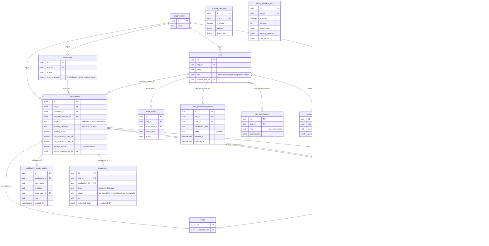

# Documento de Esquema de Datos — Nodrix

| Campo | Valor |
|---|---|
| Código de documento | NODRIX-DOC-ESQ-01 |
| Versión | 1.0 |
| Fecha | 2026-08-06 |
| Motor de base de datos | PostgreSQL 15 (Supabase) |
| Migraciones aplicadas | 37 (`database/migrations/002` a `037`) |

---

## 1. Principios de diseño

1. **Multi-tenant ready desde el día 1.** Toda tabla de negocio incluye `org_id UUID NOT NULL
   REFERENCES organizations(id)`. En el MVP se opera con un único tenant fijo
   (`00000000-0000-0000-0000-000000000001`); Row Level Security está **preparado en el schema
   pero deshabilitado operativamente** hasta que se necesite aislar más de una organización.
2. **Auditoría por diseño.** Cambios de estado (`application_stage_history`) y acciones
   administrativas sensibles (`audit_events`) se registran como filas inmutables — nunca se
   sobreescribe historial, solo se agrega.
3. **Versionado en vez de mutación** para configuración de negocio: `scoring_rule_sets` y
   `wizard_variable_sets` nunca se actualizan in-place; cada cambio crea una fila nueva con
   `is_active = true` y desactiva la anterior. Esto permite que un cálculo ya hecho sea
   reproducible/auditable exactamente como se hizo.
4. **UUIDs como llave primaria** en todas las tablas, generados en base de datos.
5. Todas las magnitudes monetarias de propiedad están en **UF** (`price_uf NUMERIC`), no en CLP —
   la conversión a CLP ocurre solo en capa de presentación con el valor UF vigente
   (`UF_VALUE_CLP`, hoy una constante documentada como placeholder de producción).

---

## 2. Diagrama entidad-relación (dominio core)

---

## 3. Catálogo de tablas

### 3.1 Dominio core (`database/schema.sql`)

| Tabla | Propósito | Notas clave |
|---|---|---|
| `organizations` | Tenant. Una fila fija en el MVP. | Ancla de multi-tenancy |
| `users` | Cuentas del equipo interno + clientes con acceso (`role`) | `role` incluye `custom`, resuelto vía `custom_role_id` |
| `customers` | Datos personales del cliente final | RUT **cifrado** (`rut_ciphertext`), nunca en texto plano en ninguna capa |
| `applications` | El expediente/solicitud — entidad central del sistema | `stage` con `CHECK` de 9 valores; `income_sources` jsonb para ingresos mixtos |
| `application_stage_history` | Auditoría inmutable de cada cambio de etapa | Fuente de verdad para duración real por etapa (desviaciones, proyección de cierres) |
| `documents` | Documentos subidos por el cliente | `extracted_data` guarda el resultado de la validación OCR |
| `properties` | Catálogo de propiedades ofertables | `price_uf`, comuna, propósito, destino, plano |
| `visits` | Visitas agendadas a una propiedad | Vinculada a `application_id` + `property_id` |
| `mortgage_operations` | Operación hipotecaria derivada de una solicitud aprobada | Puente hacia escrituración y cierre |
| `deed_appointments` | Citas de escrituración en notaría | 1:N con `mortgage_operations` |
| `closures` | Registro de cierre de la operación | 1:1 con `mortgage_operations` |
| `audit_events` | Bitácora general de acciones administrativas sensibles | Usada por el sistema de permisos, cambios de configuración |

### 3.2 Motor financiero y de negocio (migraciones incrementales)

| Tabla | Migración | Propósito |
|---|---|---|
| `scoring_rule_sets` | 003 | Pesos y umbrales del motor de scoring, versionados |
| `regions` | 019 | Regiones geográficas habilitadas para operar |
| `proposal_options` | ~058-059 (propuesta final) | Hasta 6 opciones de propiedad cargadas por el asesor por solicitud |
| `wizard_variable_sets` | 031 | Parámetros financieros del motor de pre-evaluación, versionados y publicables |
| `guarantors` | — | Avales/garantes asociados a una solicitud |

### 3.3 Sistema de permisos (migraciones 030-037)

| Tabla | Migración | Propósito |
|---|---|---|
| `role_permissions` | 030, 035, 036 | Overrides de permisos por perfil configurable (`asesor`, `gerencia`) — el rol `admin` está excluido por `CHECK` constraint |
| `custom_roles` | — | Roles ad-hoc con matriz de permisos propia |
| `user_permission_grants` | 037 | Permisos temporales por usuario individual, con `expires_at` evaluado en cada consulta (sin cron) |

---

## 4. Reglas de integridad relevantes

- `applications.stage` tiene un `CHECK` constraint con los 9 valores válidos exactos — un valor
  fuera de esa lista es rechazado a nivel de base de datos, no solo de aplicación.
- `role_permissions.role` tiene un `CHECK` constraint que **excluye explícitamente `admin`** —
  candado de seguridad a nivel de esquema, no solo de código de aplicación (ver
  `03-arquitectura-tecnologia.md`, sección de seguridad).
- `user_permission_grants.level` solo admite `view` / `edit` (nunca `none` — un grant siempre
  otorga algo, revocar es poner `revoked_at`, no bajar el nivel).
- `user_permission_grants` tiene `CHECK (expires_at > starts_at)` — un grant no puede expirar
  antes de empezar.
- Todas las claves foráneas hacia `applications` usan `ON DELETE CASCADE` desde sus tablas
  dependientes (`documents`, `visits`, `application_stage_history`, `proposal_options`) — al
  eliminar una solicitud completa se elimina su rastro relacionado.

---

## 5. Vistas/agregaciones calculadas en aplicación (no materializadas en DB)

Estas no son tablas — son cálculos que la capa de aplicación deriva en tiempo real desde las
tablas anteriores (ver `app/api/admin/kpis/route.ts`):

- **Funnel de Estados** (7 buckets) — cuántas solicitudes alcanzaron cada paso, usando
  `application_stage_history` como fuente acumulativa.
- **Desviaciones de proceso** — comparación contra el promedio histórico real de duración por
  etapa, calculado agregando `application_stage_history`.
- **Proyección de cierres** — suma de duraciones promedio de etapas restantes por solicitud
  activa.
- **Desempeño por asesor** — agregación de `applications` por `assigned_advisor_id`.

Se decidió no materializar estas vistas en SQL porque el volumen de datos del MVP no lo justifica
(evaluado explícitamente en el código); si el volumen crece, son candidatas naturales a
convertirse en vistas materializadas o funciones SQL agregadas.

---

## 6. Función espejo en SQL

`database/functions/scoring_fn.sql` reimplementa el motor de scoring de `lib/scoring.ts`
directamente en PL/pgSQL, con la misma lógica y los mismos pesos por defecto (parametrizable),
para poder ejecutar el cálculo dentro de la base de datos (trigger o RPC) si en el futuro se
necesita scoring sin pasar por la capa de aplicación Next.js.
