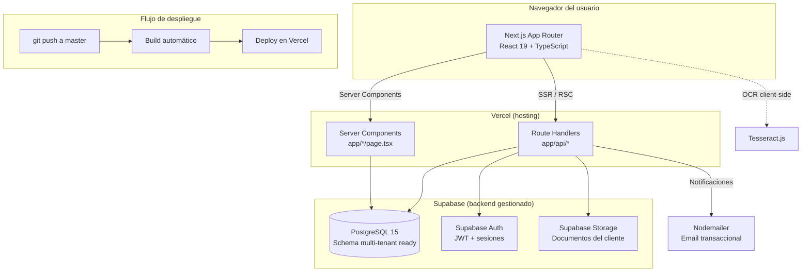

# Documento de Arquitectura y Tecnología — Nodrix

| Campo | Valor |
|---|---|
| Código de documento | NODRIX-DOC-ARQ-01 |
| Versión | 1.0 |
| Fecha | 2026-08-06 |
| Clasificación | Uso interno — Técnico |

---

## 1. Objetivo

Documentar la arquitectura técnica del sistema: stack tecnológico, patrón de despliegue,
estructura del código, decisiones de seguridad, y la postura de calidad (testing) — como soporte
a procesos de gestión de calidad y auditoría técnica.

## 2. Arquitectura de alto nivel



**Patrón:** Next.js App Router con una mezcla deliberada de **Server Components** (páginas que
requieren guard de sesión/permiso antes de renderizar, para que la restricción de acceso ocurra
en servidor y no sea evitable) y **Client Components** (interactividad: formularios, gráficos,
timelines animadas). Los **Route Handlers** (`app/api/*`) exponen la lógica de negocio como REST
interno, consumido tanto por Server como por Client Components.

## 3. Stack tecnológico

| Capa | Tecnología | Versión | Rol |
|---|---|---|---|
| Framework | Next.js | 16.2.10 | App Router, SSR, Route Handlers |
| UI Library | React | 19.2.4 | Server + Client Components |
| Lenguaje | TypeScript | ^5 | Tipado estricto en todo el codebase |
| Estilos | Tailwind CSS | ^4 | Utility-first, design tokens dark-mode |
| Componentes base | shadcn/ui (`@base-ui/react`) | ^1.6.0 | Design system accesible, tematizado |
| Gráficos | Recharts | latest | Dashboards analíticos (admin/reportes) |
| Backend as a Service | Supabase | ^2.110.3 (SDK) | Postgres + Auth + Storage + Realtime |
| OCR | Tesseract.js | ^7.0.0 | Validación de documentos en cliente |
| Email | Nodemailer | ^9.0.3 | Notificaciones transaccionales |
| Testing unitario | Vitest | ^4.1.10 | 13 archivos / 123 tests |
| Testing E2E | Playwright | ^1.61.1 | Flujo completo lead→cierre |
| Hosting | Vercel | — | Auto-deploy en push a `master` |

## 4. Estructura de directorios

```
app/                       # Next.js App Router — 1 carpeta = 1 ruta
  auth/                    # register, login, forgot-password, reset-password
  onboarding/              # welcome, wizard, processing, proposal, simulating
  dashboard/               # Portal cliente
  backoffice/              # Panel del asesor
  admin/                   # Panel de administración/gerencia
  api/                     # Route Handlers — ~17 grupos (auth, leads, applications,
                            # documents, scoring, admin/*, backoffice/*, ...)
components/
  ui/                      # Design system base (botones, cards, forms, dialogs, badges)
  admin/, backoffice/, dashboard/, wizard/, onboarding/, vault/, landing/
  Timeline.tsx             # Componente de timeline (horizontal/vertical) — ÚNICA fuente
                            # de verdad para progreso por etapa en todo el sistema
lib/                       # Motores de negocio puros (ver sección 6)
database/
  schema.sql               # Schema base
  migrations/               # 37 migraciones incrementales, numeradas y versionadas
  functions/                # Funciones SQL (espejo del motor de scoring)
tests/
  unit/                    # Vitest
  e2e/                     # Playwright
scripts/                   # Utilidades operativas (seed de usuarios staff, etc.)
docs/                      # Este set de documentación funcional/técnica
```

**Principio de organización:** cada dominio de negocio (scoring, riesgo, permisos, ingresos,
documentos) vive en un único archivo de `lib/` con responsabilidad clara, consumido tanto por
Route Handlers como por componentes de UI que necesitan la misma lógica (ej. el checklist de
documentos lo usan tanto la Bóveda del cliente como el Backoffice del asesor, desde el mismo
`lib/document-requirements.ts`).

## 5. Modelo de autenticación y autorización

1. **Autenticación:** Supabase Auth (JWT), con sesión persistida en cookie httpOnly.
2. **Roles fijos:** `cliente`, `asesor`, `gerencia`, `admin`, más `custom` (roles personalizados).
3. **Guards de página:** cada ruta protegida (`/dashboard`, `/backoffice/*`, `/admin/*`) valida
   sesión y permiso en un **Server Component wrapper** antes de renderizar cualquier contenido —
   no depende de ocultar un enlace de menú (eso es solo UX; el control real está en servidor).
4. **Modelo de permisos granular** (ver `02-esquema-de-datos.md`, sección 3.3):
   - Una vista de menú = un permiso independiente, derivado automáticamente de un único registro
     de navegación (`lib/nav-registry.ts`) para que menú y matriz de permisos nunca se desincronicen.
   - 4 capas independientes impiden que el rol `admin` sea restringible: (1) `CHECK` constraint en
     base de datos, (2) resolución de permisos que nunca consulta la tabla de overrides para
     admin, (3) tipo TypeScript que hace `getRolePermissionOverride("admin")` un error de
     compilación, (4) filtro defensivo en la lectura de overrides.
   - Permisos temporales por usuario, evaluados en **query-time** (no vía cron) — una vez pasado
     `expires_at`, el permiso deja de aplicar en la siguiente consulta, sin depender de que un job
     programado corra.
5. **Datos sensibles:** el RUT del cliente se almacena cifrado (`rut_ciphertext`), nunca en texto
   plano; se enmascara en toda vista de UI (`••.•••.•••-•`).

## 6. Motores de negocio (`lib/`)

| Archivo | Motor | Determinístico |
|---|---|---|
| `lib/scoring.ts` | Scoring crediticio (4 factores → categoría) | ✅ Sí, versionado (`rulesVersion`) |
| `lib/income-types.ts` | Consolidación de ingresos mixtos (haircuts por tipo) | ✅ Sí |
| `lib/uf-preevaluation.ts` | Pre-evaluación en UF (anualidad hipotecaria + 3 parámetros bancarios) | ✅ Sí, configurable en vivo |
| `lib/proposal-risk.ts` | % de aprobación por banda de riesgo (6 tramos) | ✅ Sí |
| `lib/loan-term.ts` | Plazo de crédito por edad/nivel profesional | ✅ Sí |
| `lib/document-requirements.ts` | Checklist de documentos requeridos por situación laboral | ✅ Sí (reglas de negocio explícitas) |
| `lib/stage-machine.ts` | Transiciones automáticas de etapa | ✅ Sí |
| `lib/permissions.ts` | Resolución de permisos efectivos por usuario | ✅ Sí |
| `lib/temporary-grants.ts` | Combinación de permisos temporales (solo eleva, nunca resta) | ✅ Sí |
| `lib/wizard-variables.ts` | Resolución de parámetros financieros versionados por solicitud | ✅ Sí |

**Ningún cálculo financiero, de scoring, o de riesgo usa un modelo de IA generativa** — son
reglas de negocio explícitas, con la misma entrada produciendo siempre la misma salida,
auditables línea por línea y con tests unitarios dedicados.

## 7. Calidad y pruebas

| Tipo | Herramienta | Cobertura |
|---|---|---|
| Unitarias | Vitest | 13 archivos / 123 tests — motores de scoring, riesgo, pre-evaluación, ingresos mixtos, permisos (incluyendo el candado anti-lockout de admin), registro de navegación |
| End-to-end | Playwright | 14 escenarios cubriendo el flujo completo lead → cierre (`tests/e2e/full-flow.spec.ts`) |
| Type-checking | TypeScript (`tsc --noEmit`) | Ejecutado en cada cambio; unión de literales (no `string` genérico) en claves de permisos para que un typo sea error de compilación |
| Build de producción | `next build` | Verificado en cada cambio antes de desplegar |

## 8. Despliegue

- **Repositorio:** GitHub, rama `master` como fuente de verdad.
- **CI/CD actual:** integración GitHub↔Vercel — cada push a `master` dispara build y deploy
  automático. No hay todavía un pipeline explícito que corra los tests antes del deploy (ver Gap
  1 del README).
- **Entorno de datos:** Supabase (Postgres gestionado). En desarrollo local se usa Supabase local
  vía Docker Compose (`docker-compose up`), con el mismo schema y migraciones que producción.

## 9. Seguridad — postura actual

| Control | Estado |
|---|---|
| Autenticación con JWT (Supabase Auth) | ✅ Implementado |
| RUT cifrado en base de datos | ✅ Implementado |
| Guards de sesión y rol en servidor (no solo cliente) | ✅ Implementado |
| Guards de permiso por página, no solo por menú | ✅ Implementado |
| Candado anti-lockout de superusuario (4 capas) | ✅ Implementado |
| Row Level Security (RLS) por organización | ⬜ Preparado en schema, deshabilitado operativamente |
| Rate limiting en endpoints públicos (registro, login) | ⬜ Pendiente |
| Auditoría de seguridad formal (PII, datos financieros) | ⬜ Pendiente |

## 10. Referencias

- `README.md` (raíz) — resumen ejecutivo y línea de tiempo del proyecto.
- `01-documento-funcional.md` — descripción de pantallas y reglas de negocio.
- `02-esquema-de-datos.md` — modelo de datos completo.
- `CLAUDE.md` / `AGENTS.md` — convenciones de desarrollo del equipo técnico.
